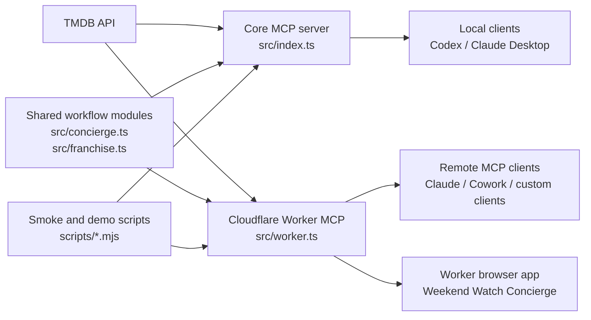

# TMDB MCP User Guide

This repo has two related but separate goals:

1. **Reusable MCP server**: an independent TMDB-powered MCP server that any compatible client can use.
2. **Feature workflows**: higher-level movie and TV workflows built on top of that server.

The distinction matters. The MCP server should stay broadly useful and stable. Feature workflows should be added only when they represent a durable user intent, not every TMDB endpoint.

## Architecture



## What Belongs Where

### MCP server surface

Expose a feature as an MCP tool when it is something a user or agent would ask for directly:

- `get_weekend_watchlist`: "Find me something to watch this weekend."
- `plan_watch_party`: "Pick a movie for a group."
- `build_franchise_watch_order`: "What order should I watch this franchise?"
- `build_collection_gap_plan`: "What am I missing in this franchise?"
- `recommend_from_taste_profile`: "Recommend something based on what I like and dislike."
- `build_person_watch_path`: "Where should I start with this actor or director?"
- `compare_movies`: "Help me choose between these movies."
- `find_where_to_watch`: "Where can I watch these titles?"

These tools combine multiple TMDB calls and return a decision-ready answer.

### Shared modules

Put reusable logic in TypeScript modules when it is internal machinery:

- ranking
- scoring
- provider matching
- title normalization
- franchise resolution
- person credit selection
- formatting and summaries

Current examples:

- `src/concierge.ts`: weekend and watch-party planning logic
- `src/franchise.ts`: franchise watch-order logic
- `src/collection-gap.ts`: franchise completion and gap planning logic
- `src/person-path.ts`: actor/director watch-path logic
- `src/taste.ts`: taste-profile recommendation logic

### Scripts and demos

Keep something as a script when it is mainly for verification, a demo story, or an artifact:

- `scripts/tool-surface-smoke.mjs`: validates the MCP tool contract
- `scripts/now-playing-follow-on-demo.mjs`: produces an example workflow artifact
- `scripts/weekly-trending-languages.mjs`: shareable language-trend demo
- `scripts/weekly-streaming-radar.mjs`: script-first weekly radar artifact
- `scripts/release-calendar-watchlist.mjs`: Markdown artifact wrapper around `build_release_calendar_watchlist`
- `scripts/provider-change-monitor.mjs`: script-first provider delta monitor with a JSON snapshot
- `scripts/collection-gap-finder.mjs`: Markdown artifact wrapper around `build_collection_gap_plan`

Scripts can chain existing tools without creating a new public MCP tool.

## Tool-Bloat Rule

Do not add a new MCP tool just because TMDB has an endpoint for it.

Add a tool only when it satisfies most of these criteria:

- A user can describe the need in one natural sentence.
- The output helps make a decision, not just inspect raw data.
- It combines multiple TMDB calls or adds useful ranking/filtering.
- The input schema is stable and simple.
- It works for local stdio MCP and the Cloudflare Worker MCP.
- It can be covered by `npm run smoke:tools`.

If a feature fails those checks, keep it as shared code or a script until it proves durable.

## Current Workflow Tools

| Tool | User intent | Best for |
| --- | --- | --- |
| `get_weekend_watchlist` | Find a ranked shortlist for tonight or the weekend | Solo or simple household viewing |
| `plan_watch_party` | Pick for a group with mixed moods and constraints | Group watch decisions |
| `build_franchise_watch_order` | Decide how to watch a franchise or universe | Multi-movie watch planning |
| `build_collection_gap_plan` | Find missing entries in a watched franchise | Franchise completion planning |
| `recommend_from_taste_profile` | Recommend from liked and disliked titles | Personalized discovery |
| `build_person_watch_path` | Find a starter path for an actor/director | Filmography decisions |
| `build_release_calendar_watchlist` | Track upcoming release-window candidates | Watch-later planning |
| `compare_movies` | Choose between known movie IDs | Side-by-side tradeoffs |
| `find_where_to_watch` | Check availability for one or more titles | Actionable provider lookup |

## Feature Pipeline

Recently added:

- `build_person_watch_path`
- `scripts/weekly-streaming-radar.mjs`
- `scripts/release-calendar-watchlist.mjs`
- `scripts/provider-change-monitor.mjs`
- `build_collection_gap_plan`
- `build_release_calendar_watchlist`
- `familySafe` filtering inside `get_weekend_watchlist` and `plan_watch_party`

Recommended next features, in order:

1. **Provider Monitor Promotion**
   - Tool: only if recurring deltas become a common direct ask
   - Output: stable MCP result for provider additions/removals, likely backed by caller-supplied snapshots
   - Why: persistence belongs outside MCP until the storage boundary is explicit.

2. **Planning Lab Expansion**
   - Status: partially implemented in the Worker browser app
   - Output: interactive tabs for collection gaps, taste profile, and person path workflows
   - Next: add release calendar as a Planning Lab tab once the UI contract is clear.

3. **Release Calendar Promotion**
   - Status: implemented as `build_release_calendar_watchlist`
   - Output: stable MCP result for release-window watch decisions
   - Next: consider adding recent-release backfill or saved watchlist state outside MCP.

## Verification Checklist

After adding or changing tools:

```bash
npm run build
npm test
set -a && source ./.env && set +a && npm run smoke:tools
WRANGLER_LOG_PATH=/tmp/wrangler-tmdb.log npm run worker:dry-run
TMDB_API_KEY=dummy node plugins/tmdb/scripts/smoke-test.mjs
```

For Worker-visible UI changes, also run the local Worker and inspect the browser app:

```bash
set -a && source ./.env && set +a && WRANGLER_LOG_PATH=/tmp/wrangler-tmdb-dev.log npm run worker:dev
```

Then open:

```text
http://127.0.0.1:8787/
```

If the change is intended for regular users, merge it to `main` and redeploy the Worker. A GitHub merge alone does not update the deployed Cloudflare Worker.
